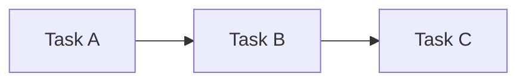

# GraphMind — User Guide

`v1.2.0` · visual project manager based on graph theory

---

## Core concepts

GraphMind organises work as a **node graph**. Each node can be a task, project, milestone or idea. Nodes connect to each other forming parent→child hierarchies and dependency relationships.

**Parent** nodes automatically aggregate their children's metrics: dates, duration, cost and completion are cascaded up the tree.

---

## Creating and editing tasks

Click **+ New task** in the sidebar to create a node. Select it to open the editor.

### Main fields

| Field | Description |
|---|---|
| **Title** | Task name |
| **Type** | Task / Project / Milestone / Idea (configurable) |
| **Status** | Pending / In progress / Review / Done / Blocked (configurable) |
| **Tags** | Type and press `Enter` or `,` to add; `Backspace` on empty field to remove last |
| **Assignee** | Person responsible |
| **Priority** | Low · Medium · High · Critical |

### Dates and metrics

| Field | Description |
|---|---|
| **Start / End** | Planned work range |
| **Deadline** | Hard deadline shown in the Gantt |
| **Duration** | Estimated effort (in the configured unit, default days) |
| **Cost** | Estimated budget (in the configured currency, default €) |
| **Completion** | Progress % (0–100) |

> On parent nodes these fields are calculated automatically from children and appear dimmed.

### Markdown description

The description field supports full **Markdown**: headings, lists, tables, code blocks, blockquotes and links.

Toggle between **Edit** and **Preview** using the buttons above the text area.

You can also embed **Mermaid** diagrams:

~~~

~~~

---

## Connecting nodes

Click **Connect** on any task to link it to another. Choose the relationship type:

| Icon | Type | Description |
|---|---|---|
| ↔ | **Related** | Generic link between nodes |
| ▲ | **This is parent** | The current node contains the other |
| ▼ | **This is child** | The current node belongs to the other |
| ⊘ | **Blocks** | This node is a prerequisite for the other |

---

## Parent nodes — automatic metrics

When a node has children, its fields are cascaded:

- **Duration and Cost** → sum of all descendants
- **Completion** → weighted average of direct children
- **Start date** → earliest among children
- **End date** → latest among children

Click **↻ Recalc** in the top bar to force all parents to update.

---

## Critical path

GraphMind automatically computes the **critical path** — the longest sequence of tasks that determines the total project duration.

- In the **Gantt**: bars with a red border
- In the **Graph**: edges highlighted in red
- In the **Editor**: `CRITICAL PATH` badge in the parent summary panel

---

## Graph view

The graph displays all nodes as an interactive network.

- **Click** a node → selects it in the editor
- **Drag** the background → pan the camera
- **Scroll** → zoom
- **Follow selected node**: the graph automatically centres on the active node
- The **legend** shows each status and type colour (collapsible)
- **Hover** over a node → tooltip with status, assignee, duration, cost, progress and deadline

---

## Gantt view

The Gantt shows date-bearing tasks as timeline bars.

- **Zoom** `+`/`−` → days-per-pixel scale
- **Today** → scroll to today
- **Group** → hierarchy / flat / by assignee / by tag
- **Filter** → by status
- **Hover** a bar → tooltip with all details
- **Click** a bar → opens the task in the editor
- 🚩 Yellow = approaching deadline · Red = overdue
- Red arrows = blocking dependencies
- Red border on bar = critical path

---

## Comments

Each task has a comments section. Comments support **Markdown and Mermaid**.

- **Add**: type in the bottom field and click **Send**
- **Edit**: click the ✎ icon (shown on hover)
  - Save with the **Save** button or `Ctrl+Enter`
  - Cancel with **Cancel** or `Escape`
- **Delete**: click the ✕ on the comment
- Edited comments display an *(edited)* mark with a full timestamp on hover

---

## Settings

Access from the **⚙ Settings** tab.

### States
Define the possible task states. The `id` is immutable; only the name and colour are editable.

### Types
Configure node types: name, graph shape (`circle`, `rect`, `diamond`), colour, border colour and whether it groups children.

### Appearance
- **Theme**: Dark / Light / Custom (with colour token pickers)
- **Currency**: symbol used for costs (default `€`)
- **Duration unit**: unit used for duration (default `d`)

All changes take effect when you press **✓ Save changes**.

---

## Saving and exporting

| Method | Description |
|---|---|
| **Auto-save** | Every change is saved to `localStorage` ~800ms later |
| **Export JSON** | Exports all data to a portable JSON file |
| **Import JSON** | Loads data from a previously exported JSON |

Reopening the app in the same browser automatically restores the session.

---

## Language

Click the 🇬🇧 / 🇪🇸 button in the top bar to switch between **English** and **Spanish**. The language preference is saved in the browser.

---

## Keyboard shortcuts

| Key | Action |
|---|---|
| `Esc` | Close open modals |
| `Enter` or `,` | Add tag (in the tags field) |
| `Backspace` | Remove last tag (with empty tags field) |
| `Ctrl+Enter` | Save a comment edit |
| `Escape` | Cancel a comment edit |

---

*GraphMind v1.2.0 · self-contained HTML · no server · no subscription*
