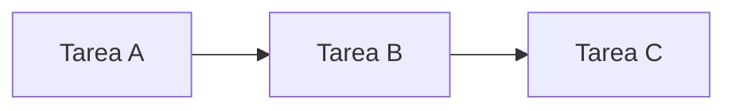

# GraphMind — Guía de uso

`v1.2.0` · gestor de proyectos visual basado en teoría de grafos

---

## Conceptos básicos

GraphMind organiza el trabajo como un **grafo de nodos**. Cada nodo puede ser una tarea, proyecto, hito o idea. Los nodos se conectan formando jerarquías padre→hijo y relaciones de dependencia.

Los nodos **padre** agregan automáticamente las métricas de sus hijos: fechas, duración, coste y completitud se calculan en cascada hacia arriba.

---

## Crear y editar tareas

Pulsa **+ Nueva tarea** en la barra lateral para crear un nodo. Selecciónalo para abrir el editor.

### Campos principales

| Campo | Descripción |
|---|---|
| **Título** | Nombre de la tarea |
| **Tipo** | Tarea / Proyecto / Hito / Idea (configurable) |
| **Estado** | Pendiente / En curso / Revisión / Hecho / Bloqueado (configurable) |
| **Tags** | Escribe y pulsa `Enter` o `,` para añadir; `Backspace` con campo vacío para borrar |
| **Asignado a** | Persona responsable |
| **Prioridad** | Baja · Media · Alta · Crítica |

### Fechas y métricas

| Campo | Descripción |
|---|---|
| **Inicio / Fin** | Rango de trabajo planificado |
| **Fecha límite** | Deadline visible en el Gantt |
| **Duración** | Esfuerzo estimado (en la unidad configurada, por defecto días) |
| **Coste** | Presupuesto estimado (en la moneda configurada, por defecto €) |
| **Completitud** | % de avance (0–100) |

> En nodos padre, estos campos se calculan automáticamente desde los hijos y aparecen sombreados.

### Descripción con Markdown

El campo de descripción soporta **Markdown completo**: headings, listas, tablas, código, blockquotes y enlaces.

Cambia entre **Editar** y **Vista previa** con los botones sobre el área de texto.

También puedes insertar diagramas **Mermaid**:

~~~

~~~

---

## Conexiones entre nodos

Pulsa **+ enlazar** en cualquier tarea para conectarla con otra. Elige el tipo de relación:

| Icono | Tipo | Descripción |
|---|---|---|
| ↔ | **Relacionado** | Vínculo genérico entre nodos |
| ▲ | **Este es padre** | El nodo actual contiene al otro |
| ▼ | **Este es hijo** | El nodo actual pertenece al otro |
| ⊘ | **Bloquea** | Este nodo es prerequisito del otro |

---

## Nodos padre — métricas automáticas

Cuando un nodo tiene hijos, sus campos se calculan en cascada:

- **Duración y Coste** → suma de todos los descendientes
- **Completitud** → media ponderada de los hijos directos
- **Fecha inicio** → la más temprana de los hijos
- **Fecha fin** → la más tardía de los hijos

Pulsa **↻ Recalcular** en la barra superior para forzar la actualización de todos los padres.

---

## Camino crítico

GraphMind calcula automáticamente el **camino crítico** — la secuencia de tareas más larga que determina la duración total del proyecto.

- En el **Gantt**: barras con borde rojo
- En el **Grafo**: aristas resaltadas en rojo
- En el **Editor**: badge `CAMINO CRÍTICO` en el resumen del nodo padre

---

## Vista Grafo

El grafo muestra todos los nodos como una red interactiva.

- **Click** en un nodo → lo selecciona en el editor
- **Drag** en el fondo → mueve la cámara
- **Scroll** → zoom
- **Seguir nodo seleccionado**: el grafo centra automáticamente la vista en el nodo activo
- La **leyenda** muestra el color de cada estado y tipo (ocultable)
- El **tooltip** al hacer hover muestra estado, asignado, duración, coste, progreso y deadline

---

## Vista Gantt

El Gantt muestra las tareas con fechas como barras temporales.

- **Zoom** `+`/`−` → escala de días por pixel
- **Hoy** → centra la vista en la fecha actual
- **Agrupar** → jerarquía / plano / por asignado / por tag
- **Filtrar** → por estado
- **Hover** sobre una barra → tooltip con todos los detalles
- **Click** en una barra → abre la tarea en el editor
- 🚩 Amarillo = deadline próximo · Rojo = vencido
- Flechas rojas = dependencias de bloqueo
- Borde rojo en barra = camino crítico

---

## Comentarios

Cada tarea tiene una sección de comentarios. Los comentarios soportan **Markdown y Mermaid**.

- **Añadir**: escribe en el campo inferior y pulsa **Enviar**
- **Editar**: pulsa el icono ✎ (aparece al pasar el ratón)
  - Guarda con el botón **Guardar** o `Ctrl+Enter`
  - Cancela con **Cancelar** o `Escape`
- **Eliminar**: pulsa la ✕ del comentario
- Los comentarios editados muestran la marca *(editado)* con el timestamp en tooltip

---

## Configuración

Accede desde la pestaña **⚙ Config**.

### Estados
Define los estados posibles de una tarea. El `id` es inmutable; solo edita nombre y color.

### Tipos
Configura los tipos de nodo: nombre, forma en el grafo (`circle`, `rect`, `diamond`), color, borde y si agrupa hijos.

### Apariencia
- **Tema**: Oscuro / Claro / Personalizado (con selector de tokens de color)
- **Moneda**: símbolo para los costes (por defecto `€`)
- **Duración**: unidad para la duración (por defecto `d`)

Todos los cambios se aplican al pulsar **✓ Guardar cambios**.

---

## Guardar y exportar

| Método | Descripción |
|---|---|
| **Guardado automático** | Cada cambio se guarda en `localStorage` ~800ms después |
| **Exportar JSON** | Exporta todos los datos a un JSON portable |
| **Importar JSON** | Carga datos desde un JSON exportado anteriormente |

Al reabrir la app en el mismo navegador, la sesión se restaura automáticamente.

---

## Idioma

Pulsa el botón 🇬🇧 / 🇪🇸 en la barra superior para cambiar entre **Español** e **Inglés**. El idioma se guarda en el navegador.

---

## Atajos de teclado

| Tecla | Acción |
|---|---|
| `Esc` | Cierra modales abiertos |
| `Enter` o `,` | Añade tag (en el campo de tags) |
| `Backspace` | Elimina el último tag (con campo de tags vacío) |
| `Ctrl+Enter` | Guarda la edición de un comentario |
| `Escape` | Cancela la edición de un comentario |

---

*GraphMind v1.2.0 · HTML autocontenido · sin servidor · sin suscripción*
